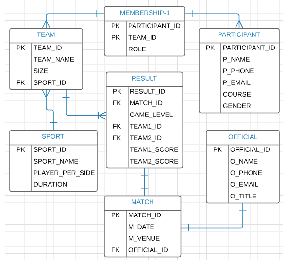

# SQL DEMO: Summer Games
A MySQL based database design to manage college summer games data
## What
This repo can be used to quickly build a MySQL database to practice SQL skills e.g. queries.  
**Note**: It does not provide a application interface to manipulate the database 
and expects the to use tools such as PHPMyAdmin. 
## Client Requirements
Design a relational database that is capable of maintaining: 
- Events
- Participants
- Matches
- Results
- Overall tournament standing.
## ERD - Entity Relation Diagram

## Usage
Please feel free to use the work any way you like.  
Share if someone needs it.  
Point out if you find any errors or advice.  
Thanks :)

